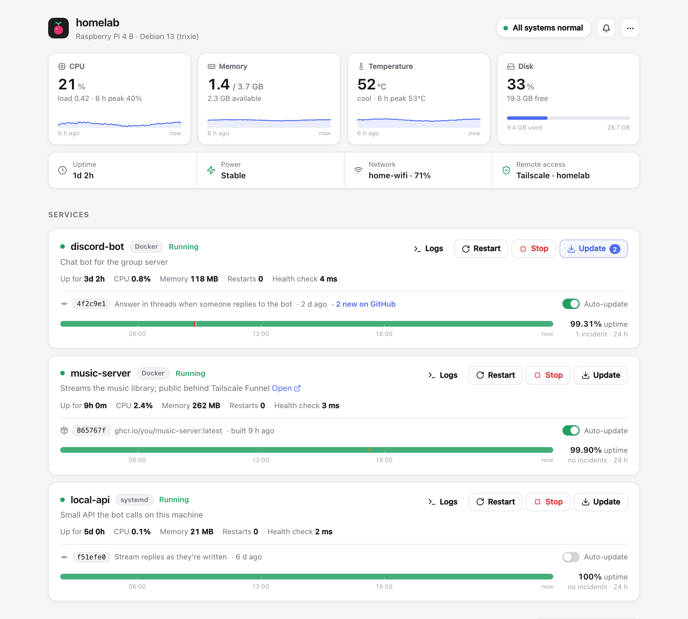
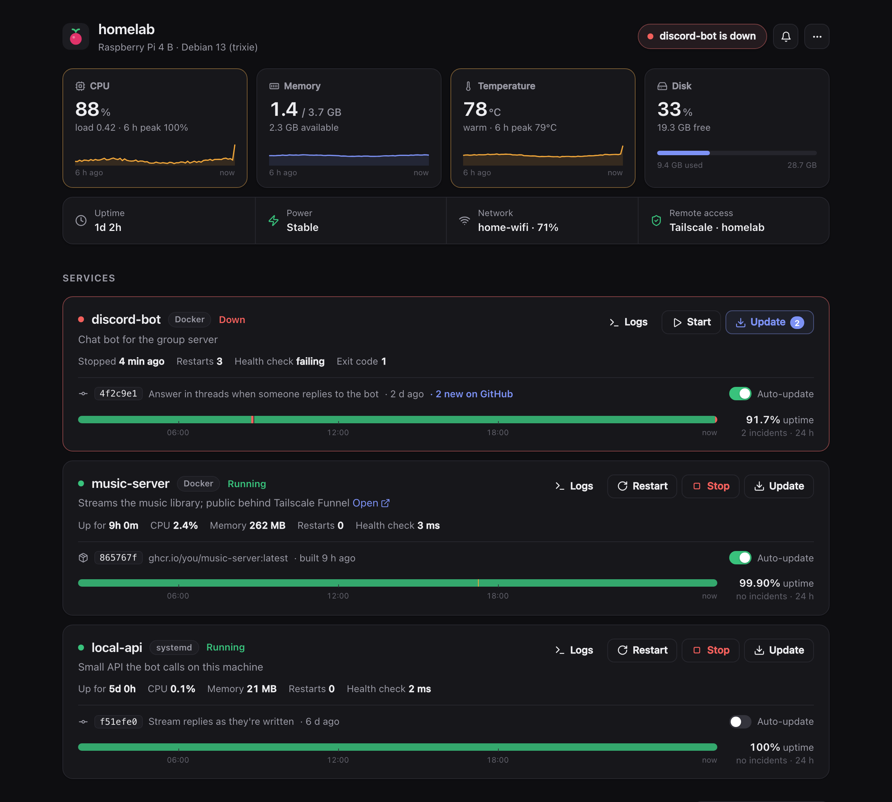
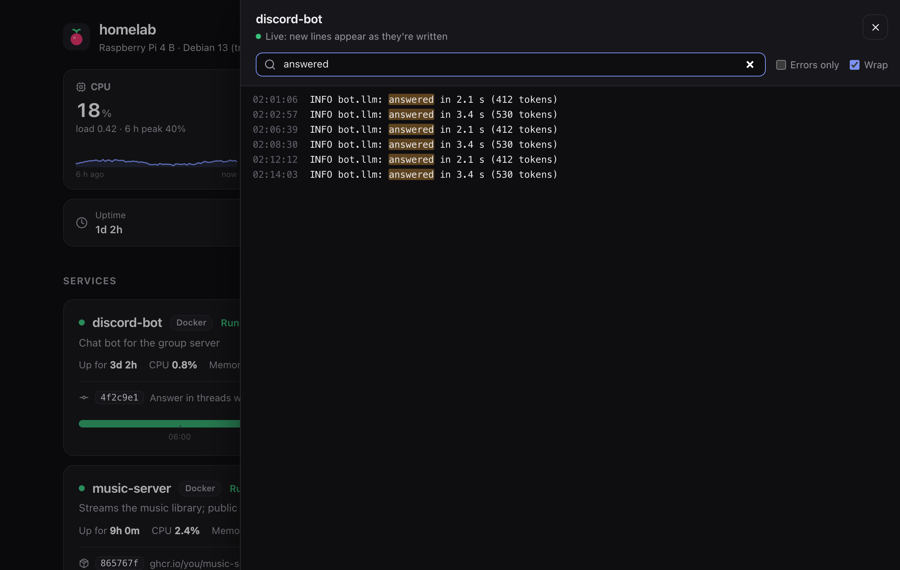
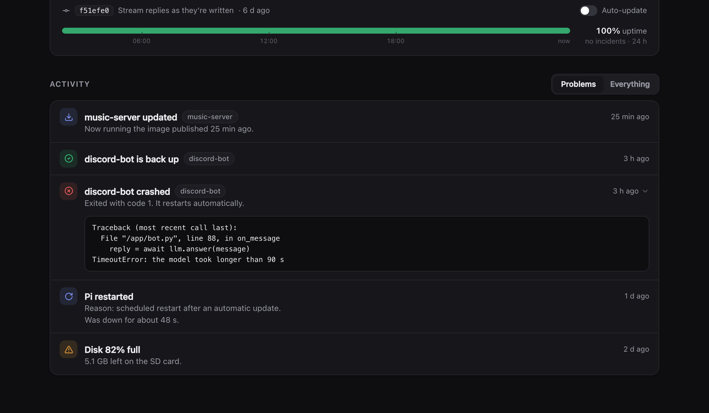
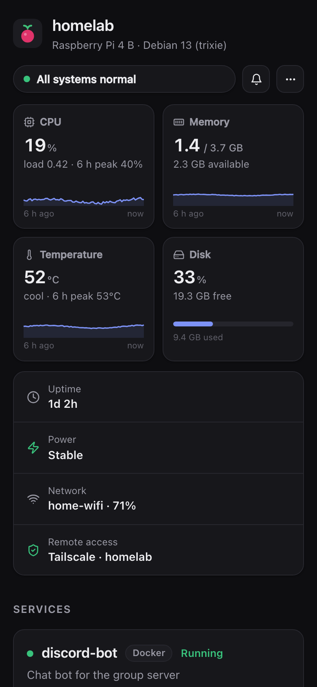

# pi-dash

A small dashboard and Discord alerter for the services on a home server such as a Raspberry Pi. One page shows every service and the machine itself; Discord tells you when something needs you, and stays quiet otherwise.

No dependencies: Python 3.11+ standard library and one static page. It uses about 30 MB of memory and under 1 % CPU on a Pi 4.

<picture>
  <source media="(prefers-color-scheme: dark)" srcset="docs/overview-dark.png">
  
</picture>

## What it does

- **Services** (Docker Compose, systemd user or system units): running state, a 24 h uptime timeline, CPU and memory, health check, the commit or image that's running and whether a newer one exists. Live logs with search; start, stop, restart and update buttons.
- **The machine**: CPU, memory and temperature over the last 6 h, disk, power (Raspberry Pi under-voltage), Wi-Fi, Tailscale. Restart or shut down from the menu.
- **Discord alerts**, only when something is wrong: a crash (with its last log lines), errors in a service's log, a service down or back up, disk filling up, overheating, low power, failed systemd units or automatic updates, and every restart of the machine with the reason. Red alerts can @mention you. A morning summary, and a mute switch for when you're tinkering.
- **Auto-update**: every 5 minutes it checks for a new commit (services built from a git checkout) or a newly published image (services that pull one). If there is one it runs the service's update steps, waits for it to come back healthy, and tells you. A version that fails isn't retried until a newer one appears. It can be switched off per service.

When something breaks, the header, the card and the history say so, and Discord pings you:



| Live logs, with search and an errors-only filter | Activity, with the log lines behind each alert |
|---|---|
|  |  |



## Security model

The dashboard can stop, restart and update your services, so keep it private:

- Reach it over a VPN such as [Tailscale](https://tailscale.com), and keep the port closed to everything else with a firewall (`ufw default deny incoming`, then `ufw allow in on tailscale0`).
- Set a password unless you're the only one who can reach it: `install.sh` offers to, or later `python3 -m pidash.passwd`. It's stored as a scrypt hash; signing in gives a 30-day HttpOnly session, and repeated wrong guesses are locked out. Requests from the server itself (curl on localhost) don't need it.
- For HTTPS inside your tailnet: `sudo tailscale serve --bg --https=9443 http://127.0.0.1:9000`, then open `https://<machine>.<tailnet>.ts.net:9443`.
- Never expose it with Tailscale Funnel, port forwarding or a public reverse proxy.

The API only answers requests addressed to this machine's own names (against DNS rebinding) and only accepts changes that carry a custom header (against cross-site requests). It runs as your user; root is limited by `/etc/sudoers.d/pi-dash` to rebooting, shutting down and starting, stopping or restarting units.

## Install

On the server (Debian, Ubuntu or Raspberry Pi OS with systemd):

```bash
git clone https://github.com/Xiao215/pi-dash ~/services/pi-dash
cd ~/services/pi-dash && ./install.sh
```

`install.sh` asks for your Discord webhook and user ID (both optional), writes `/etc/pi-dash/config.toml`, installs the `pi-dash` systemd service running as you, and starts it on port 9000. Run it again after changing the service template; it keeps your settings.

Settings are in `/etc/pi-dash/config.toml` (see [config.example.toml](config.example.toml)): port, Discord webhook and pings, schedule, thresholds. Restart after editing: `sudo systemctl restart pi-dash`.

## Adding services

List them in `~/services/services.json`; [examples/services.example.json](examples/services.example.json) shows the three kinds:

| Field | |
|---|---|
| `name`, `description` | shown on the card |
| `kind` | `compose`, `systemd-user` or `systemd` |
| `dir` | the service's folder; update steps run here |
| `container` / `unit` | the container (compose) or unit (systemd) to watch |
| `health` | optional URL that answers 2xx while healthy |
| `check` | optional `{"command", "problem", "every"}`: a command that must succeed, e.g. "is it logged in?"; when it fails the card turns amber and shows `problem` |
| `update` | shell steps for the Update button and auto-update |
| `repo` | the git checkout inside `dir`, if not `dir` itself |
| `url` | optional link on the card |

Then reload the list: `curl -X POST -H 'X-Pi-Dash: 1' http://localhost:9000/api/reload`.

Tips: give containers `restart: unless-stopped` and a fixed `container_name`. Send Docker logs to journald (`"log-driver": "journald"` in `/etc/docker/daemon.json`) so the dashboard can show and watch them. Published Docker ports bypass ufw; prefer `network_mode: host` or binding to `127.0.0.1`.

## Updating pi-dash

```bash
git -C ~/services/pi-dash pull --ff-only && sudo systemctl restart pi-dash
```

State (activity feed, uptime samples) lives in `/var/lib/pi-dash` and is pruned after 7 days.

## Development

```bash
python3 -m unittest discover -s tests   # unit tests; no Pi needed
node --check static/app.js
```

To work on the page without a server, run the demo: it serves the real page with made-up data.

```bash
python3 tools/demo.py              # http://localhost:9100
python3 tools/demo.py --trouble    # a service down, a hot CPU
```

`tools/screenshots.cjs` regenerates the images in `docs/` from the demo (needs Playwright). The watchers need systemd, journald and Docker, so try those changes on the server itself.

## License

MIT
